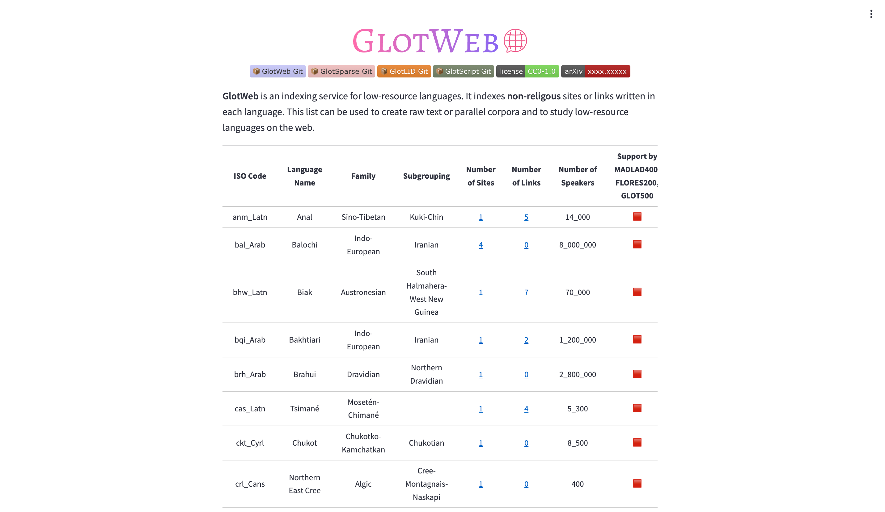

# GlotWeb

[](https://huggingface.co/spaces/cis-lmu/GlotWeb)

# Step 1: Set up SearXNG and perform search

##  SearXNG

### Install
```bash

export PORT=8080

docker pull searxng/searxng
docker run --rm \
             -d -p ${PORT}:8080 \
             -v "${PWD}/searxng:/etc/searxng" \
             -e "BASE_URL=http://localhost:${PORT}/" \
             -e "INSTANCE_NAME=my-instance" \
             searxng/searxng
```

**add JSON output format:**

In the `${PWD}/searxng` directory, there is a file named `settings.yml`. In that file, you need to enable the JSON output format in the SearX configuration under the `search.formats` key like this:

```yml
search:
  formats:
    - html
    - json
```

**modify uwsgi.ini :**
In the `${PWD}/searxng` directory, there is a file named `uwsgi.ini`. In that file you need to modify buffer-size. Default is 8k. Increasing to 9k sometimes help with 'Internal Error 500'.

Default Value:
```ini
buffer-size = 8192
```
Change to:
```ini
buffer-size = 9216
```

## Search Service Script: search_service.py

This is an object-oriented Python script that leverages the Searx API to perform searches and save the results to JSON files. The script is configurable using a YAML configuration file called 'search_config.yaml'.

### Features

- Uses SearxSearchWrapper for querying multiple search engines.
- Handles retries for failed requests.
- Configurable search parameters through a YAML file.
- Configurable input file, search range, output directory, and other parameters.
- Automatically saves results in a structured JSON format.

### Configuration file parameters:

```yml
searx_host: "http://127.0.0.1:8080"  # Searx instance URL
engines:
  - "bing"
  - "yahoo"
  - "qwant"
  - "duckduckgo"  # Search engines to be used
num_results: 50  # Number of results to fetch for each query
max_retries: 3  # Maximum number of retries for failed requests
retry_wait_time: 2  # Wait time (in seconds) between retries
output_file_prefix: "results"  # Prefix for output file names
output_directory: "search_dump"  # Directory to save output files
input_file: "input.txt"  # Path to the input file containing search queries
start_index: 0  # Start index for queries to process
end_index: 10  # End index for queries to process
```
### Input file format:
The input file should be a tab-separated file where each line contains an ISO code and a sentence for search:
```txt
ISO_CODE_1    Search query 1
ISO_CODE_2    Search query 2
```

```txt
aa	Itiyobbiyah agattinoona sittal xayyossa yangalen qaadoodih baari gablusaanamah angicille le.
aai	Baise orot ta’ita’imon matah toniwa’an bar hinanutitiy gewas hinawowab.
aak	O xewanɨŋo na'nɨ re rɨnɨŋɨnigɨnɨ, ‘A'mɨna' sea'yɨ e imo'nɨŋa' wonɨrɨnɨ.’
```
The iso code for the input text file can be either 2 lettered format or 3 lettered format.

### Usage
Run the script using:
pwd should be be root of the directory.
```bash
python pipeline/search_service.py
```
The search results will be saved in the specified output directory (e.g., search_dump) as JSON files named according to the specified prefix and index range, e.g., results_0-10.json.

### Customization
You can easily adjust the following parameters in the config.yaml file:

- Search engines: Add or remove engines in the engines list.
- Search range: Modify start_index and end_index to control which lines in the input file are processed.
- Output directory: Change output_directory to save results in a different location.

# Step 2: Filter and generate seeds

## Overview
This script filters web search dump/results based on domain restrictions, scrapes web pages, and performs language identification a FastText model for which we chose GlotLID. The processed data is stored in JSON format categorized by predicted languages.

## Prerequisites
### Dependencies
Ensure you have the following Python packages installed:

```bash
pip install fasttext trafilatura urllib3 tqdm pyyaml
```
Configuration already provided in the repository and must be changed according to user preferneces. Examples below:

```yaml
model_path: "path/to/fasttext/model"
domain_file: "path/to/domain_filter.txt"
json_filename: "path/to/input.json"
iso_list_file: "path/to/iso_list.json"
output_directory: "path/to/output"
```

## Running the Script
Execute the script with:
pwd should be be root of the directory.
```bash
python pipeline/language_filter.py
```

# Step 3: Search and scrape with seeds

## Overview
This step takes the filtered seed URLs from Step 2 and performs deep crawling to discover additional web pages in the target languages. It includes:
- Web crawling from seed URLs
- Language detection using FastText (GlotLID)
- Domain filtering
- Parallel processing for efficiency
- Comprehensive logging and metadata collection

## Prerequisites
### Dependencies
Ensure you have the following Python packages installed:
```bash
pip install fasttext beautifulsoup4 requests trafilatura tqdm pyyaml urllib3
```

### Configuration
The script uses config.yaml with these key parameters:

```yaml
seed_crawler:
  max_pages: 100            # Maximum pages to crawl per language
  max_time: 3600              # Maximum crawling time in seconds
  crawl_delay: 1              # Delay between requests
  to_visit_growth_factor: 50   # Threshold for detecting circular links
  max_workers: 4              # Threads for parallel processing

url_settings:
  request_timeout: 10         # Timeout for web requests
  max_url_length: 65000         # Maximum URL length to consider

language_detector:
  model_path: "path/to/model" # Path to FastText model
  minimum_confidence: 0.7     # Minimum language confidence score
  desired_language: "bpy_Beng"      # Target language code
  save_text: False            # Whether to save scraped text

output:
  directory: "output"         # Output directory
  output_file_name: "{language}_filtered.json"  # Output filename pattern

batch_processing:
  enabled: False              # Enable batch mode
  input_labels: []            # List of language codes for batch
  cooldown_between_languages: 60  # Cool-down between languages
```

### Input Requirements
Input JSON files from Step 2 (named as [LANGUAGECODE_SCRIPT].json)

Each JSON file should contain entries with:

- link: URL string

- lid_confidence: Confidence score (float)

- predicted_lid: Language code

### Output
For each processed language, the script generates:

[LANGUAGE_CODE]_filtered.json - Filtered URLs with metadata

meta_data/[LANGUAGE_CODE]_meta_data.json - Crawling statistics including:

Seed URLs used

All discovered links

Filtered links

Unique new links

Rejected links

Usage
Single Language Processing
bash
Copy
python pipeline/seed_crawler.py
Configure desired_language in config.yaml first.

Batch Processing
Enable batch mode in config.yaml:

```yaml
batch_processing:
  enabled: True
  input_labels: ["syl_Sylo", "bpy_Beng", "akh_Latn"]  # Your target languages
```
Run the same command:

```bash
python pipeline/seed_crawler_beta.py
```
### Customization Options
- Crawling Behavior:

Adjust max_pages and max_time to control crawling scope

Modify crawl_delay to be more/less aggressive

- Language Detection:

Change minimum_confidence for stricter/looser filtering

- Set save_text: True to store scraped content

- Performance:

Increase max_workers for faster processing (requires more CPU)

Adjust cooldown_between_languages for batch processing

### Output:

Change output directory and filename patterns

Metadata collection is always enabled

### Notes
The script automatically skips domains listed in your domain filter file

Progress bars are enabled by default (can be disabled in config)

Comprehensive logging helps troubleshoot issues

# Step 4: Filtering and Deduplication

## Step 4.1: Domain Filtering

### Purpose
This script performs final domain filtering on crawled results to exclude unwanted domains from both the main output and metadata files.

### Key Features
- Loads crawled data and metadata JSON files
- Applies domain filtering using the configured domain blocklist
- Updates all metadata statistics after filtering
- Handles both single-language and batch processing modes

### Why Use It
- Ensures final outputs comply with domain restrictions
- Maintains consistency between data files and their metadata
- Prepares clean data for subsequent deduplication steps

### Usage
Configure `domain_file` path in `config.yaml` and run:
```bash
python result_filtering/final_domain_filter.py
```

### Configuration
Uses these key config parameters:

```yaml
domain_file: "path/to/domain_filter.txt"  # List of domains to exclude
output:
  directory: "output"                    # Where to find/save files
```
### Output
Updates both:

[LANGUAGE]_filtered.json - With domain-filtered results

meta_data/[LANGUAGE]_meta_data.json - With filtered statistics

## Step 4.2: Formatting Output for GlotWeb

### Purpose
Transforms crawled language data into a structured format suitable for GlotWeb visualization, enriching it with metadata and linguistic information.

### Key Features
- Extracts language metadata (speaker counts, language family)
- Checks inclusion in major multilingual datasets (MADLAD-400, Flores, Glot500)
- Organizes URLs by domain with site categorization
- Handles both single-language and batch processing

### Why Use It
- Creates standardized format for GlotWeb frontend
- Enriches raw data with valuable linguistic metadata
- Provides domain-level organization of web resources
- Generates compatibility flags for popular multilingual datasets

### Configuration
```yaml
output:
  formated_directory: "formatted_output"  # Output directory
  formated_file_name: "{language}_formatted.json"  # Output filename pattern
```
### Usage
```bash
python result_filtering/format_for_glotweb.py
```

## Step 4.3: Robots.txt Compliance Filtering

### Purpose
Filters out domains that explicitly block Common Crawl's CCBot in their robots.txt file, ensuring compliance with website crawling policies.

### Key Features
- Checks each domain's robots.txt for CCBot restrictions
- Removes entire domains if they block CCBot
- Preserves all other metadata while filtering
- Handles both single-language and batch processing

### Why Use It
- Ensures ethical web scraping compliance
- Prevents potential legal issues
- Maintains good web citizenship by respecting robots.txt
- Filters before final dataset compilation

### Configuration
```yaml
output:
  formated_directory: "formatted_output"  # Input directory (from Step 4.2)
  cleaned_directory: "cleaned_output"    # Output directory for filtered data
```
### Usage
```bash
python pipeline/robots_compliance_filter.py
```
### Process Flow
- Loads formatted JSON from Step 4.2
- For each domain:
- Fetches robots.txt
- Checks for CCBot restrictions
- Saves cleaned version with compliant domains only

### Output
- Maintains same structure as input
- Only contains domains that allow CCBot
- Saved as [LANGUAGE].json in cleaned directory

### Notes
- If robots.txt is inaccessible, assumes crawling is allowed
- Only checks for explicit CCBot blocks (not general User-agent: *)
- Processes domains sequentially with 5-second timeout
- Preserves all non-URL metadata (speaker counts, language family etc.)
